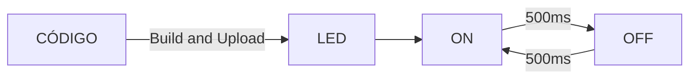
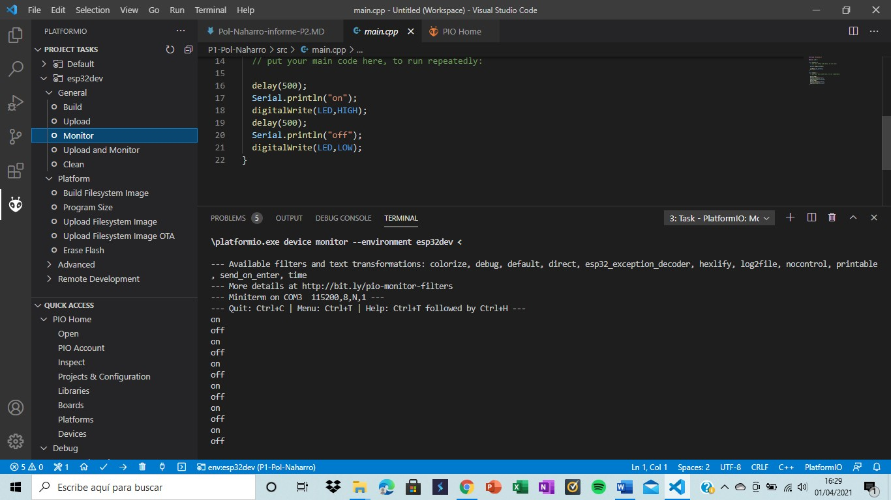

Pol Naharro
## PRACTICA 1  :  BLINK 


###### Código: 

```
#include <Arduino.h>
#define LED 0

void setup() {
  // put your setup code here, to run once:

  Serial.begin(115200);

  pinMode(LED,OUTPUT);
}

void loop() {
  // put your main code here, to run repeatedly:

  delay(500);
  Serial.println("on");
  digitalWrite(LED,HIGH);
  delay(500);
  Serial.println("off");
  digitalWrite(LED,LOW);
}
```

###### Diagrama de flujo:

###### Diagrama de tiempos:

```wavedrom
{ "signal": [
    { "name": "clk", "wave": "hlhlhlhl" },
    { "name": "led", "wave": "72727272", "data":["ON","OFF","ON","OFF","ON","OFF","ON","OFF"] }
    ]}
```
###### Funcionamiento de la práctica:
Comprobación de la pantalla:
